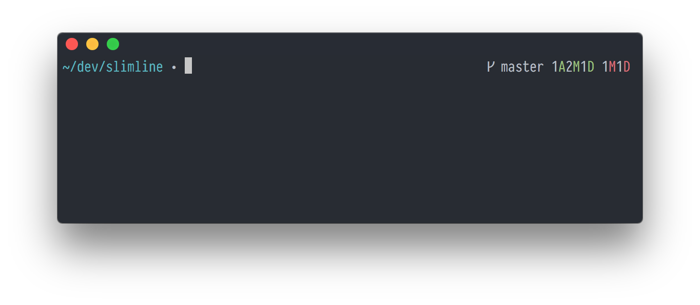
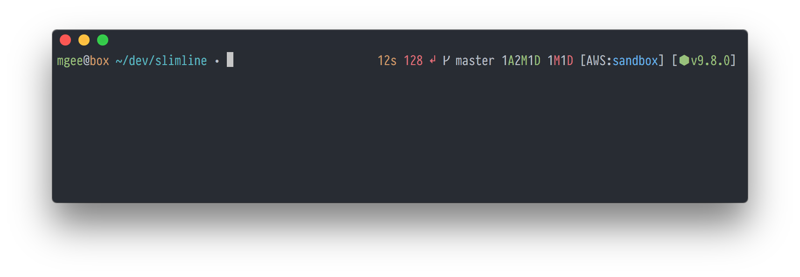

# slimline

Minimal, fast and elegant ZSH prompt. Displays the right information at the right time.

Features:
- sleek look
- asynchronous git information display using [git-radar](https://github.com/michaeldfallen/git-radar)
- the prompt symbol is colored red, when all asynchronous tasks are finished it turns white
- exit code of last command if the exit code is not zero
- runtime of executed command if it exceeds a threshold
- username and host name if connected to a ssh server



With all information (connected to ssh server, runtime and exit status from last command):


## Requirements

* zsh

## Installation

Choose one of the methods below.

### [antigen](https://github.com/zsh-users/antigen)

```
antigen bundle mgee/slimline
```

### [zgen](https://github.com/tarjoilija/zgen)

```
zgen load mgee/slimline
```

### Manually

Clone the repository:

```git clone --recursive https://github.com/mgee/slimline.git```

Source the prompt in your `.zshrc` (or other appropriate) file:

```source <path-to-slimline>/slimline.zsh```

## Options

### `SLIMLINE_PROMPT_SYMBOL`

Defines the symbol of the prompt. Default is `∙`.

### `SLIMLINE_EXIT_STATUS_SYMBOL`

Defines the symbol of the exit status glyph. Default is `↵`.

### `SLIMLINE_ENABLE_GIT_RADAR`

Defines whether git-radar shall be used to display git information. Default is `1`.

### `SLIMLINE_PERFORM_GIT_FETCH`

Defines whether git-radar shall perform a `git fetch` automatically (default: every 5 minutes) for the current git repository (on prompt rendering). Default is `1`.

### `SLIMLINE_DISPLAY_EXEC_TIME`

Defines whether the runtime of a process is displayed if it exceeds the maximum execution time specified by the option below. Default is `1`.

### `SLIMLINE_MAX_EXEC_TIME`

Defines the maximum execution time of a process until its run time is displayed on exit. Default is `5` seconds.

### `SLIMLINE_DISPLAY_EXIT_STATUS`

Defines whether the exit status is displayed if the exit code is not zero. Default is `1`.

### `SLIMLINE_DISPLAY_SSH_INFO`

Defines whether the `user@host` part is displayed if connected to a ssh server. Default is `1`.

## Git Radar Options

### Format

Git Radar allows customizing the output format via the `GIT_RADAR_FORMAT` environment variable.
See [this page](https://github.com/michaeldfallen/git-radar/blob/47addd8b811e77f3be815fea56bcaeddd89edea0/README.md#customise-your-prompt) for details.

Slimline uses a custom format for Git Radar output. However, if you set a custom
format via `GIT_RADAR_FORMAT` before sourcing Slimline this format will be used instead.

### Colors

Git Radar colors can be configured via environment variables.
See [this page](https://github.com/michaeldfallen/git-radar/blob/47addd8b811e77f3be815fea56bcaeddd89edea0/README.md#configuring-colours) for details.

**Note:** Use `%F{color}` to specify the color.
For example to color the branch name yellow use this line in your zsh configuration:
```shell
export GIT_RADAR_COLOR_BRANCH="%F{yellow}"
```

### Auto-fetch time

Git Radar can automatically perform a `git fetch`, see option `SLIMLINE_PERFORM_GIT_FETCH`.
The interval of the fetch can be customized using the environment variable `GIT_RADAR_FETCH_TIME`.
See [this page](https://github.com/michaeldfallen/git-radar/tree/47addd8b811e77f3be815fea56bcaeddd89edea0#optional-auto-fetch-repos) for details.

## Thanks to

- [sindresorhus/pure](https://github.com/sindresorhus/pure)
- [sorin-ionescu/prezto](https://github.com/sorin-ionescu/prezto.git)
- [michaeldfallen/git-radar](https://github.com/michaeldfallen/git-radar)

## License

Released under the [MIT License](LICENSE)
